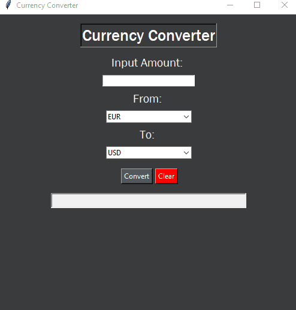

# Currency Converter

<p align="center">

</p>

<h2 style="display: inline-block">Table of Contents</h2>
<ol>
  <li><a href="#about-the-project">About The Project</a></li>
  <li>
    <a href="#getting-started">Getting Started</a>
    <ul>
      <li><a href="#prerequisites">Prerequisites</a></li>
      <li><a href="#installation">Installation</a></li>
    </ul>
  </li>
  <li><a href="#usage">Usage</a></li>
</ol>

## About The Project

A Currency converter app with GUI written in Python using Tkinter module.

## Getting Started

To run this app follow these instructions.

### Prerequisites

To run this project, make sure you have Python installed. You can download Python from the official website: [python.org](https://www.python.org/downloads/)

### Installation

1. Clone the project
   ```sh
   git clone https://github.com/kadurinadav/Currency-Converter.git
   ```
2. Go to project directory.
3. Start the app
   ```sh
   python app.py
   ```
