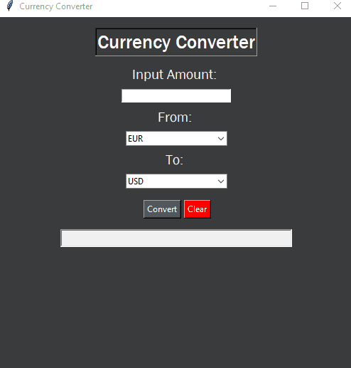

# Currency Converter
A Currency converter GUI written in Python using Tkinter module.

<<<<<<< HEAD
<<<<<<< HEAD
| |
=======

>>>>>>> 3e4e63e53ba8bd4312b37dad022e881689870121
=======

>>>>>>> 3e4e63e53ba8bd4312b37dad022e881689870121

